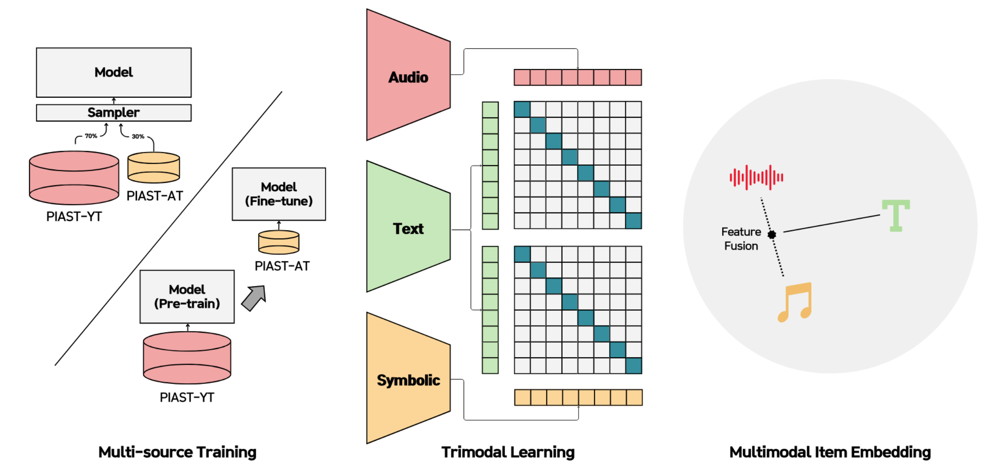

# 🎹 PianoBind: A Multimodal Joint Embedding Model for Pop-piano Music
[](https://arxiv.org/abs/2509.04215)
[](https://hayeonbang.github.io/PianoBind/)
[](https://huggingface.co/Hayeonbang/PianoBind)
[](https://hayeonbang.github.io/PIAST_dataset/)




🎹 **PianoBind** is a piano-specific multimodal joint embedding model that aligns **Audio**, **MIDI**, and **Text** in a unified space for enhanced **piano music understanding**.

## Quick Start

```bash
git clone https://github.com/Hayeonbang/PianoBind.git
cd PianoBind
pip install -r requirements.txt
```

## Demo & Resources

- **Demo**: [Demo Page](https://hayeonbang.github.io/PianoBind/)
- **Pre-trained Models**: [Hugging Face Hub](https://huggingface.co/Hayeonbang/PianoBind)
- **PIAST Dataset**: [Dataset Repository](https://hayeonbang.github.io/PIAST_dataset/)

## Citation

```bibtex
@inproceedings{bang2025pianobind,
  title={PianoBind: A Multimodal Joint Embedding Model for Pop-piano Music},
  author={Bang, Hayeon and Choi, Eunjin and Doh, Seungheon and Nam, Juhan},
  booktitle={Proceedings of the 26th International Society for Music Information Retrieval Conference},
  year={2025}
}
```

## Authors

**Music and Audio Computing Lab, KAIST**  
Hayeon Bang, Eunjin Choi, Seungheon Doh, Juhan Nam
